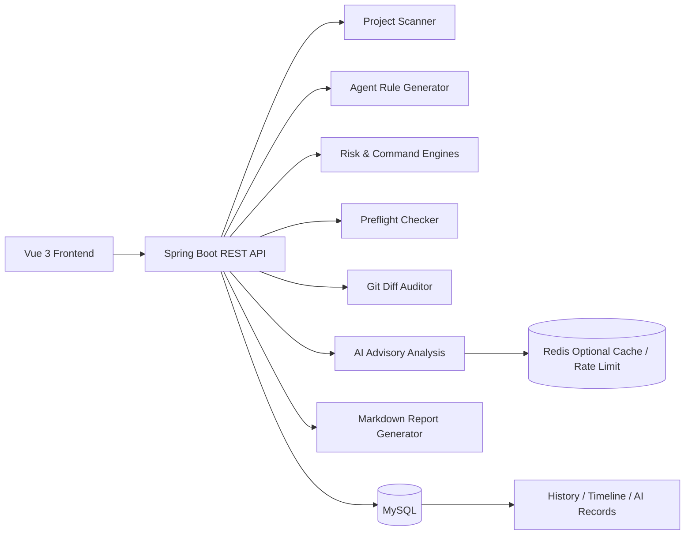

# AgentGuard


AgentGuard 是一个面向 Codex、Claude Code、Cursor 等 AI Coding Agent 的项目上下文生成与权限安全治理平台。它帮助团队在真实项目里解决上下文缺失、权限配置不透明、危险命令不可控、敏感文件暴露、代码变更难审计等问题。

## Why AgentGuard

AI Coding Agent 越强，越需要清晰的边界。AgentGuard 把项目扫描、Agent 规则生成、权限评估、命令审计、执行前预检、Git Diff 审计和安全报告串成一条可复查的链路，让团队能在“让 Agent 做事”之前知道风险在哪里，也能在事后还原发生过什么。

## Highlights

| 能力 | 说明 |
|---|---|
| 项目扫描 | 识别技术栈、关键文件、敏感文件、Git/AGENTS 状态和基础风险 |
| Agent 规则生成 | 为 CODEX、CLAUDE、CURSOR 生成项目上下文规则文件 |
| 权限风险评估 | 评估 sandbox、approval、network、delete 等配置风险 |
| 危险命令审计 | 检测删除、强制 Git、远程脚本执行、敏感文件读取等命令 |
| Preflight Check | 在 Agent 执行前综合检查项目、规则、权限、命令和变更状态 |
| Git Diff 审计 | 对未提交变更做风险识别，并给出回滚建议 |
| AI 增强分析 | 基于 Spring AI/OpenAI-compatible 模型生成影响分析、风险解释、报告摘要，且不改变规则引擎结论 |
| AI 缓存与限流 | Redis 可选集成：AI 结果缓存（SHA-256 key）+ 项目级分钟/天频率限制，Redis 不可用时自动降级 |
| AI 调用审计 | 持久化 provider、model、mocked、success、latency、输入摘要、输出和错误原因 |
| 报告持久化 | 风险分数、摘要、结构化 payload 入库，支持历史查询还原 |
| 安全时间线 | 汇总扫描、规则、报告和审计事件，形成项目安全轨迹 |

## Screens

AgentGuard 前端提供项目扫描、仪表盘、权限评估、命令审计、Preflight、Git 审计、报告和时间线视图。启动前后端后访问：

```text
http://localhost:5173
```

## Architecture



## Tech Stack

| Layer | Stack |
|---|---|
| Backend | Java 17, Spring Boot 3.3, MyBatis-Plus, MySQL |
| Frontend | Vue 3, TypeScript, Vite, Element Plus, Axios |
| Cache / Rate Limit | Redis 7 (optional, graceful degradation when unavailable) |
| Test | JUnit 5, Spring Boot Test, H2 integration database |
| Tooling | Maven, npm, CI workflow template |

## Quick Start

### 1. Initialize Database

```sql
CREATE DATABASE agentguard DEFAULT CHARACTER SET utf8mb4 COLLATE utf8mb4_unicode_ci;
```

```bash
cd backend
mysql -u root -p agentguard < src/main/resources/db/init.sql
```

### 2. Configure Backend

Backend supports environment variables, so credentials do not need to be committed.

```powershell
$env:AGENTGUARD_DB_URL="jdbc:mysql://localhost:3306/agentguard?useUnicode=true&characterEncoding=UTF-8&useSSL=false&serverTimezone=Asia/Shanghai&allowPublicKeyRetrieval=true"
$env:AGENTGUARD_DB_USERNAME="root"
$env:AGENTGUARD_DB_PASSWORD="your-password"
```

AI is disabled by default and safely falls back to mock responses when no key is configured. To use a real OpenAI-compatible provider:

```powershell
$env:AGENTGUARD_AI_API_KEY="your-api-key"
$env:AGENTGUARD_AI_BASE_URL="https://api.deepseek.com"
$env:AGENTGUARD_AI_MODEL="deepseek-chat"
```

Then set `agentguard.ai.enabled=true` in backend configuration or pass it as a Spring Boot runtime property. AI output is advisory only; final risk levels always come from the rule engine.

#### Redis (Optional)

Redis enables AI result caching and per-project rate limiting. All features are disabled by default — no Redis required for basic operation.

```powershell
# Start Redis with Docker
docker run -d --name agentguard-redis -p 6379:6379 redis:7-alpine

# Enable Redis
$env:AGENTGUARD_REDIS_ENABLED="true"
$env:AGENTGUARD_REDIS_HOST="localhost"
$env:AGENTGUARD_REDIS_PORT="6379"
$env:AGENTGUARD_REDIS_USERNAME=""   # optional; use "root" if your Redis ACL user is root
$env:AGENTGUARD_REDIS_PASSWORD=""   # optional

# Enable caching (reduces redundant LLM calls)
$env:AGENTGUARD_AI_CACHE_ENABLED="true"
$env:AGENTGUARD_AI_CACHE_TTL_SECONDS="3600"

# Enable rate limiting (controls API costs)
$env:AGENTGUARD_AI_RATE_LIMIT_ENABLED="true"
$env:AGENTGUARD_AI_RATE_LIMIT_PER_MINUTE="10"
$env:AGENTGUARD_AI_RATE_LIMIT_PER_DAY="200"
```

Cache is checked before rate limiting, so repeated identical AI requests can return `cached=true` without consuming model quota. If Redis is unavailable at runtime, AI endpoints degrade gracefully — no cache, no rate limit, same behavior as without Redis. The Dashboard AI status card and `GET /api/ai/status` show whether Redis is actually reachable.

### 3. Start Backend

```bash
cd backend
mvn spring-boot:run
```

Health check:

```text
GET http://localhost:8080/api/health
```

### 4. Start Frontend

```bash
cd frontend
npm install
npm run dev
```

Open:

```text
http://localhost:5173
```

## Validation

```bash
cd backend
mvn test
```

```bash
cd frontend
npm run build
```

The backend test suite includes real HTTP integration tests with temporary H2 databases. They cover project scanning, report persistence, AI mock/empty-key/degradation flows, AI record queries, Git audit payload restoration, and historical query restoration.

## Documentation

- [Backend README](backend/README.md)
- [API Documentation](backend/docs/API.md)
- [Demo Guide](backend/docs/DEMO.md)
- [Risk report schema upgrade](backend/docs/SCHEMA_UPGRADE_20260504_RISK_REPORT.sql)
- [GitHub Actions CI template](docs/ci-github-actions.example.yml)
- [Contributing](CONTRIBUTING.md)
- [Security Notes](SECURITY.md)

## Repository Hygiene

The repository ignores local reports, test fixtures, `.env` files, build outputs, Maven targets, `node_modules`, and IDE metadata. Before publishing, the intended source tree was scanned for common secret patterns such as passwords, API keys, tokens, private keys, and PEM blocks.

## Roadmap

- Authentication and role-based access control
- Configurable risk rules and organization policies
- SARIF / CI security report export
- More Agent adapters and policy templates
- Project-level trend analytics

## License

MIT
